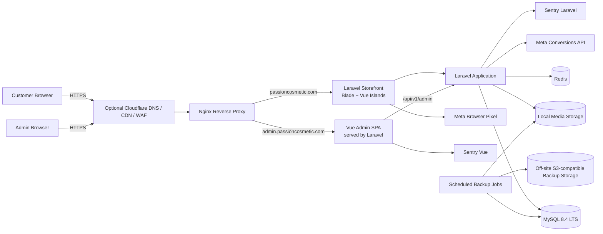
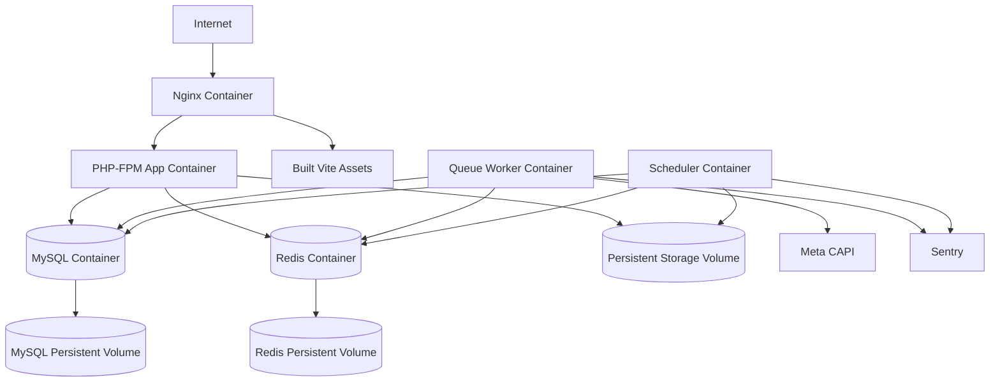
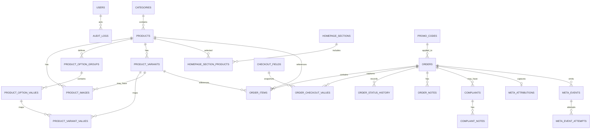
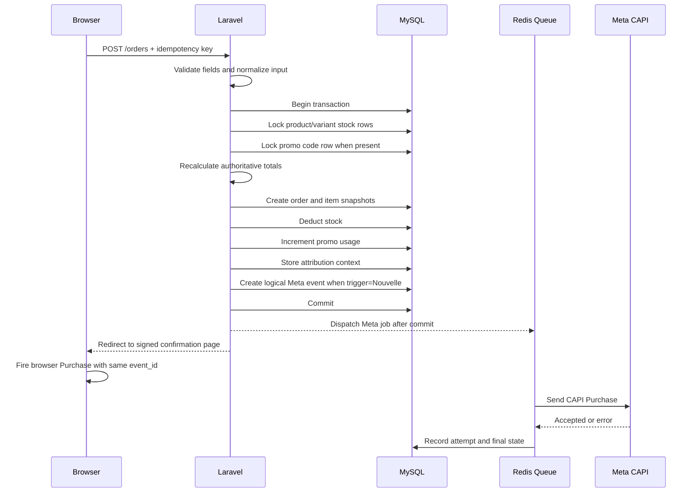

# System Design Document

## Passion Cosmetic E-Commerce Platform

**Document version:** 1.0  
**Status:** Approved architecture baseline  
**Documentation language:** English  
**Application UI language:** French only  
**Target deployment:** Single VPS  
**Primary design priorities:** Security, performance, Meta tracking reliability, SEO, operational simplicity, maintainability, and easy deployment

---

## 1. Purpose

This document translates the approved Product Requirements Document and authorization matrix into an implementation architecture for Codex and human reviewers.

It defines:

- The application architecture and deployment topology
- The technology stack
- Storefront and back-office separation
- Core domain modules and code boundaries
- Database schema, constraints, relationships, and indexes
- Authentication and authorization architecture
- Order, inventory, promotion, complaint, and content workflows
- Meta Pixel and Conversions API architecture
- Redis usage for cache, sessions, queues, locks, and rate limiting
- SEO and performance strategy
- File storage, backup, monitoring, and deployment design
- Technical guardrails that implementation must not violate

Detailed request and response payloads belong in `api-contracts.md`. Full security controls belong in `security-rules.md`. UI specifications belong in `design.md`.

---

## 2. Architecture Goals

The system must:

1. Deliver a very fast, mobile-first French storefront.
2. Provide indexable, server-rendered HTML for SEO.
3. Keep the customer experience account-free and Cash-on-Delivery only.
4. Provide a separate protected French back office.
5. Support products with arbitrary variant groups and combinations.
6. Keep pricing, stock, promotions, shipping, and order totals authoritative on the server.
7. Prevent overselling and duplicate order submissions.
8. Deliver Meta browser and server events reliably, with deduplication, retries, logs, and idempotency.
9. Keep secrets out of the browser, source control, logs, and audit records.
10. Run on one VPS without microservices or real-time infrastructure.
11. Use Redis for cache, sessions, queues, rate limiting, and short-lived locks.
12. Use Sentry as the only external application-monitoring platform.
13. Support reproducible, low-risk deployment and rollback.
14. Keep the code structure understandable for Codex and maintainable by a small team.

---

## 3. Non-Goals and Explicit Exclusions

The initial architecture does not include:

- Customer accounts or customer authentication
- Online payment gateways
- Multiple currencies
- Multiple UI languages
- WebSockets, Reverb, or real-time features
- Microservices
- Elasticsearch, OpenSearch, or an external search cluster
- A separate frontend SSR Node.js runtime
- A mobile application
- Product reviews
- Email, SMS, or WhatsApp order notifications
- Multiple warehouses
- Multiple delivery zones or city-dependent delivery prices
- Per-variant prices
- A public GraphQL API
- Kubernetes
- Prometheus, Grafana, Datadog, New Relic, or Laravel Horizon in production

---

## 4. Key Architecture Decisions

| Decision | Selected approach | Reason |
|---|---|---|
| Overall architecture | Modular Laravel monolith | Lowest operational complexity while preserving clear domain boundaries |
| Public storefront | Laravel Blade server rendering with Vue 3 interactive islands | Best balance of SEO, mobile speed, Vue usability, and simple deployment |
| Back office | Vue 3 + TypeScript SPA served by Laravel | Rich admin UX without affecting public SEO |
| Backend | Laravel 12 on PHP 8.2 | Supported local baseline with authentication, validation, queues, cache, and testing support |
| Database | MariaDB 10.4 locally | MySQL-compatible local database with transactions, constraints, indexes, and mature tooling |
| Cache and queues | Memurai locally | Redis-compatible cache, session storage, rate limiting, locks, and durable queue processing |
| Runtime web server | Nginx + PHP-FPM | Predictable Laravel production stack and static-asset performance |
| Monitoring | Sentry for Laravel and Vue | Centralized errors, traces, releases, queue failures, and frontend errors |
| Deployment | Docker Compose on one VPS | Reproducible environment, simple service management, easy rollback |
| Payments | Cash on Delivery only | Approved business requirement |
| Customer identity | Guest checkout only | Simplest customer journey |
| Money storage | Integer millimes | Exact TND arithmetic without floating-point errors |
| Meta tracking | Browser Pixel + server-side CAPI | Best practical event coverage and diagnostic control |
| Public search | MySQL-backed search | Adequate for expected catalogue size; no external search infrastructure |
| Media | Local VPS storage with off-server backups | Simple initial deployment; CDN/object-storage ready later |

---

## 5. System Context



Cloudflare is recommended but not required for the first deployment. The application must remain functional without it.

---

## 6. Runtime and Deployment Topology



### 6.1 Production services

The Docker Compose production stack contains:

- `nginx`: HTTPS termination or reverse proxy behind the host TLS layer; static assets; PHP forwarding
- `app`: Laravel PHP-FPM application
- `queue`: Laravel Redis queue worker using the same application image
- `scheduler`: Laravel scheduler using the same application image
- `mysql`: MySQL 8.4 LTS
- `redis`: Redis 8.x

Node.js is used only in the image build stage to compile Vite assets. Node.js is not required as a production runtime service.

### 6.2 Persistent volumes

Persistent data is limited to:

- MySQL data
- Redis persistence data
- Laravel public media
- Laravel private complaint attachments
- Temporary backup staging when needed

Application source code is immutable inside the deployed image.

---

## 7. Technology Stack

### 7.1 Backend

- PHP 8.2
- Laravel 12
- Laravel Eloquent ORM
- Laravel Form Requests
- Laravel Policies and Gates
- Laravel Sanctum for cookie-based back-office authentication
- Laravel Redis queue driver
- Laravel Cache and Rate Limiter
- Laravel Scheduler
- Laravel HTTP Client for Meta CAPI
- Pest on PHPUnit for automated tests
- Composer with locked dependencies

### 7.2 Frontend

#### Storefront

- Laravel Blade for server-rendered pages
- Vue 3 + TypeScript for interactive islands only
- Vite for compilation
- Tailwind CSS or a similarly controlled utility-first styling system
- Minimal client-side state
- Browser `localStorage` for the guest cart

Vue storefront islands include only components that genuinely require client interactivity, such as:

- Product image gallery
- Variant selector
- Cart drawer or cart counter
- Checkout field enhancements
- Search suggestions
- Filter controls where progressive enhancement is useful
- Meta browser event bridge

#### Back office

- Vue 3 + TypeScript
- Vue Router
- Pinia
- Vite
- Server-state composables or a small query abstraction
- No server-side rendering requirement

### 7.3 Data and infrastructure

- MariaDB 10.4 through XAMPP for local development
- Memurai for Redis-compatible local development
- Nginx
- PHP-FPM
- No container runtime during local development
- S3-compatible remote backup destination
- Sentry Laravel SDK
- Sentry Vue SDK

---

## 8. Repository and Application Structure

A single repository is recommended.

```text
passion-cosmetic/
├── app/
│   ├── Domain/
│   │   ├── Catalog/
│   │   ├── Content/
│   │   ├── Checkout/
│   │   ├── Orders/
│   │   ├── Inventory/
│   │   ├── Promotions/
│   │   ├── Complaints/
│   │   ├── MetaTracking/
│   │   ├── Identity/
│   │   ├── Settings/
│   │   └── Audit/
│   ├── Http/
│   │   ├── Controllers/
│   │   │   ├── Storefront/
│   │   │   ├── PublicApi/
│   │   │   └── AdminApi/
│   │   ├── Middleware/
│   │   ├── Requests/
│   │   └── Resources/
│   ├── Jobs/
│   ├── Listeners/
│   ├── Policies/
│   ├── Providers/
│   └── Support/
├── bootstrap/
├── config/
├── database/
│   ├── factories/
│   ├── migrations/
│   └── seeders/
├── resources/
│   ├── views/
│   │   ├── layouts/
│   │   ├── storefront/
│   │   └── seo/
│   ├── js/
│   │   ├── storefront/
│   │   │   ├── components/
│   │   │   └── entries/
│   │   ├── admin/
│   │   │   ├── api/
│   │   │   ├── components/
│   │   │   ├── pages/
│   │   │   ├── router/
│   │   │   ├── stores/
│   │   │   └── main.ts
│   │   └── shared/
│   └── css/
├── routes/
│   ├── storefront.php
│   ├── public-api.php
│   ├── admin.php
│   ├── admin-api.php
│   └── console.php
├── storage/
├── tests/
│   ├── Feature/
│   ├── Unit/
│   ├── Architecture/
│   └── Browser/
├── infra/
│   ├── docker/
│   ├── nginx/
│   ├── scripts/
│   └── compose/
├── docs/
├── Dockerfile
├── compose.yaml
└── vite.config.ts
```

### 8.1 Domain module rule

Each domain module owns its business actions, services, enums, DTOs, and tests. HTTP controllers remain thin.

Examples:

```text
app/Domain/Orders/
├── Actions/
│   ├── CreateOrder.php
│   ├── EditOrder.php
│   ├── TransitionOrderStatus.php
│   └── RecalculateOrder.php
├── DTOs/
├── Enums/
│   └── OrderStatus.php
├── Events/
├── Exceptions/
├── Models/
├── Services/
└── ValueObjects/
```

Do not introduce repository interfaces around Eloquent unless an actual testing or persistence boundary requires them. Avoid ceremonial enterprise layers that add code without protecting a business rule.

---

## 9. Host and Route Separation

### 9.1 Storefront host

```text
https://passioncosmetic.com
```

The storefront host serves:

- Public Blade pages
- Public search suggestions
- Cart quote validation
- Checkout submission
- Complaint submission
- Public media

### 9.2 Back-office host

```text
https://admin.passioncosmetic.com
```

The admin host serves:

- Admin SPA shell
- Admin authentication endpoints
- Protected `/api/v1/admin/*` endpoints
- Private complaint attachments through authorized controllers

### 9.3 Cookie isolation

Admin session cookies must be host-only for `admin.passioncosmetic.com` whenever possible.

Recommended cookie properties:

- `Secure`
- `HttpOnly`
- `SameSite=Lax` or stricter after testing
- Host-only domain
- Short idle lifetime
- Session regeneration after login

The public storefront does not need an authenticated Laravel session for customer identity.

---

## 10. Application Modules

### 10.1 Catalog

Owns:

- Categories
- Products
- Product images
- Variant groups
- Variant values
- Purchasable variant combinations
- Stock availability display
- Product activation state
- SEO product fields

### 10.2 Content

Owns:

- Hero banners
- Announcement bar
- Homepage sections
- Selected products in custom sections
- Static pages
- Footer and contact content
- Social and WhatsApp links
- Public navigation configuration

### 10.3 Checkout and Pricing

Owns:

- Cart quote validation
- Server-authoritative price calculation
- Promotional product price selection
- Promo-code validation
- Shipping calculation
- Checkout custom fields
- Idempotent order submission

### 10.4 Orders

Owns:

- Order creation
- Order snapshots
- Order edits
- Status transitions
- Order notes
- Order status history
- Print/export views
- Delivered-revenue calculations

### 10.5 Inventory

Owns:

- Product-level stock
- Variant-level stock
- Low-stock thresholds
- Atomic deduction
- Automatic restoration
- Manual return restocking decision
- Stock adjustment audit

### 10.6 Promotions

Owns:

- Product promotional price rules
- Promo-code validation
- Promo-code global usage limit
- Promo-code active dates
- Minimum order threshold
- Atomic usage counter updates

### 10.7 Complaints

Owns:

- Public complaint submission
- Attachment handling
- Complaint statuses
- Order linking
- Internal notes

### 10.8 Meta Tracking

Owns:

- Pixel configuration
- Encrypted CAPI token
- Purchase-trigger configuration
- Browser event identifiers
- Attribution context
- Logical Meta events
- CAPI queue jobs
- Deduplication IDs
- Retry policy
- Attempt logs
- Diagnostics dashboard data

### 10.9 Identity and Access

Owns:

- Admin authentication
- Super Admin and Admin roles
- Password reset by Super Admin
- Account activation/deactivation
- Protected critical actions
- Last-Super-Admin protection

### 10.10 Settings

Owns typed, validated settings for:

- Shipping fee
- Free-shipping threshold
- Promo-field visibility
- Contact details
- Store information
- Announcement bar
- Meta configuration references

### 10.11 Audit

Owns append-only audit records for important back-office changes.

---

## 11. Authentication and Authorization Design

### 11.1 Authentication

Only back-office users authenticate.

Use Laravel Sanctum with cookie-based sessions, CSRF protection, and Redis-backed session storage.

Login sequence:

1. Browser obtains CSRF cookie.
2. User submits email and password.
3. Laravel applies login rate limits.
4. Password is verified using Laravel hashing.
5. Session identifier is regenerated.
6. User role and active status are checked.
7. Vue loads `/api/v1/admin/me`.

### 11.2 Roles

Use a single non-null `role` column on `users`:

- `super_admin`
- `admin`

A separate roles/permissions package is intentionally avoided because the approved model contains exactly two fixed roles and one role per account.

### 11.3 Authorization

Authorization is enforced with:

- Route authentication middleware
- Role middleware for global sections
- Laravel policies for resources
- Gates for critical global actions
- Explicit service-layer guards for state transitions

Frontend route guards and hidden buttons are not security boundaries.

### 11.4 Critical-action confirmation

The following actions require recent password confirmation:

- Change Meta Purchase trigger
- Replace Pixel ID or CAPI token
- Disable Meta tracking
- Reset another user’s password
- Disable or change the role of a Super Admin
- Other destructive actions defined in the security document

The Meta trigger change additionally requires a typed confirmation phrase.

---

## 12. API Architecture Overview

All JSON APIs use:

```text
/api/v1/*
```

### 12.1 Public API groups

Representative endpoints:

```text
GET  /api/v1/public/search/suggestions
POST /api/v1/public/cart/quote
POST /api/v1/public/orders
POST /api/v1/public/complaints
```

Public catalogue and category pages are primarily server-rendered routes, not API-only pages.

### 12.2 Admin API groups

```text
/api/v1/admin/auth/*
/api/v1/admin/dashboard/*
/api/v1/admin/products/*
/api/v1/admin/categories/*
/api/v1/admin/orders/*
/api/v1/admin/complaints/*
/api/v1/admin/promo-codes/*
/api/v1/admin/content/*
/api/v1/admin/checkout-fields/*
/api/v1/admin/settings/*
/api/v1/admin/meta/*
/api/v1/admin/users/*
/api/v1/admin/audit-logs/*
```

### 12.3 API conventions

- JSON request and response bodies
- Stable error envelope
- Validation errors use HTTP 422
- Authorization failures use HTTP 403
- Authentication failures use HTTP 401
- Conflicts such as stale order versions or stock races use HTTP 409
- Rate-limit responses use HTTP 429
- Resource identifiers exposed publicly use ULIDs or unguessable public references
- Internal auto-increment IDs are not used in public URLs
- Pagination is mandatory for back-office list endpoints
- Filtering and sorting use allow-lists
- No endpoint accepts a price or final total as authoritative customer input

Exact contracts belong in `api-contracts.md`.

---

## 13. Database Conventions

### 13.1 General conventions

- Storage engine: InnoDB
- Character set: `utf8mb4`
- Collation: a modern Unicode collation suitable for French text
- Primary keys: unsigned `BIGINT` for internal relational performance
- Public references: ULID or cryptographically random token
- Timestamps: UTC in the database; display in `Africa/Tunis`
- Money: unsigned integer millimes
- Boolean state: explicit booleans, not nullable flags
- Enumerated business states: PHP backed enums plus database check constraints where practical
- Foreign keys: enabled
- Destructive cascades: avoided for business records
- Soft deletion: products and categories may use `deleted_at`; orders and audit records never do
- Sensitive configuration: encrypted at application level

### 13.2 Money representation

TND supports three decimal places. Store all money as integer millimes.

```text
1 TND = 1000 millimes
```

Examples:

```text
12.500 TND -> 12500
99.000 TND -> 99000
```

Never use JavaScript or PHP floating-point arithmetic for authoritative totals.

---

## 14. Entity Relationship Diagram



---

## 15. Database Schema and Indexes

The following schema is the implementation baseline. Migration names and exact database types may be refined without changing the domain meaning.

### 15.1 `users`

| Column | Type | Notes |
|---|---|---|
| `id` | BIGINT PK | Internal ID |
| `public_id` | CHAR(26) | ULID, unique |
| `name` | VARCHAR(150) | Required |
| `email` | VARCHAR(255) | Normalized, unique |
| `password` | VARCHAR(255) | Hashed |
| `role` | VARCHAR(32) | `super_admin` or `admin` |
| `is_active` | BOOLEAN | Default true |
| `force_password_change` | BOOLEAN | Default false |
| `last_login_at` | TIMESTAMP nullable | |
| `password_changed_at` | TIMESTAMP nullable | |
| `disabled_at` | TIMESTAMP nullable | |
| timestamps | | |
| `deleted_at` | TIMESTAMP nullable | Soft removal only |

Indexes and constraints:

- Unique `public_id`
- Unique normalized `email`
- Index `(role, is_active)`
- Check role allow-list
- Application rule prevents removal or downgrade of the final active Super Admin

### 15.2 `categories`

| Column | Type | Notes |
|---|---|---|
| `id` | BIGINT PK | |
| `public_id` | CHAR(26) | Unique |
| `name` | VARCHAR(160) | French name |
| `slug` | VARCHAR(190) | Unique |
| `is_active` | BOOLEAN | |
| `sort_order` | INT UNSIGNED | |
| `seo_title` | VARCHAR(255) nullable | |
| `seo_description` | VARCHAR(320) nullable | |
| timestamps | | |
| `deleted_at` | TIMESTAMP nullable | |

Indexes:

- Unique `public_id`
- Unique `slug`
- Index `(is_active, sort_order)`
- Index `name`

### 15.3 `products`

| Column | Type | Notes |
|---|---|---|
| `id` | BIGINT PK | |
| `public_id` | CHAR(26) | Unique |
| `category_id` | BIGINT FK | Required |
| `name` | VARCHAR(200) | Required |
| `slug` | VARCHAR(190) | Unique |
| `short_description` | TEXT nullable | |
| `full_description` | LONGTEXT nullable | Sanitized rich text or controlled HTML |
| `regular_price_millimes` | BIGINT UNSIGNED | Required |
| `promotional_price_millimes` | BIGINT UNSIGNED nullable | Must be lower than regular price |
| `stock_quantity` | INT UNSIGNED nullable | Used only without variants |
| `low_stock_threshold` | INT UNSIGNED nullable | Product-level when no variants |
| `is_active` | BOOLEAN | |
| `has_variants` | BOOLEAN | Derived and maintained consistently |
| `seo_title` | VARCHAR(255) nullable | |
| `seo_description` | VARCHAR(320) nullable | |
| `published_at` | TIMESTAMP nullable | Supports “new products” ordering |
| timestamps | | |
| `deleted_at` | TIMESTAMP nullable | |

Indexes and constraints:

- Unique `public_id`
- Unique `slug`
- Index `(category_id, is_active)`
- Index `(is_active, published_at)`
- Index `(is_active, regular_price_millimes)`
- Index `(is_active, promotional_price_millimes)`
- Index `(category_id, is_active, regular_price_millimes)`
- FULLTEXT index on `name`, `short_description` when supported and validated
- Check regular price greater than or equal to zero
- Check promotional price is null or lower than regular price

### 15.4 `product_images`

| Column | Type | Notes |
|---|---|---|
| `id` | BIGINT PK | |
| `product_id` | BIGINT FK | Required |
| `product_variant_id` | BIGINT FK nullable | Optional variant-specific image |
| `path` | VARCHAR(500) | Optimized public image |
| `original_path` | VARCHAR(500) nullable | Optional retained original |
| `alt_text` | VARCHAR(255) nullable | SEO/accessibility |
| `width` | INT UNSIGNED nullable | |
| `height` | INT UNSIGNED nullable | |
| `sort_order` | INT UNSIGNED | |
| `is_primary` | BOOLEAN | Product primary image |
| timestamps | | |

Indexes:

- Index `(product_id, sort_order)`
- Index `(product_variant_id)`
- Partial uniqueness is enforced in application logic for one primary product image

### 15.5 `product_option_groups`

Examples: Color, Size.

| Column | Type | Notes |
|---|---|---|
| `id` | BIGINT PK | |
| `product_id` | BIGINT FK | |
| `name` | VARCHAR(120) | |
| `sort_order` | INT UNSIGNED | |
| timestamps | | |

Indexes:

- Unique `(product_id, name)`
- Index `(product_id, sort_order)`

### 15.6 `product_option_values`

| Column | Type | Notes |
|---|---|---|
| `id` | BIGINT PK | |
| `product_option_group_id` | BIGINT FK | |
| `value` | VARCHAR(120) | Green, Blue, Small, Medium |
| `sort_order` | INT UNSIGNED | |
| timestamps | | |

Indexes:

- Unique `(product_option_group_id, value)`
- Index `(product_option_group_id, sort_order)`

### 15.7 `product_variants`

Represents one purchasable combination.

| Column | Type | Notes |
|---|---|---|
| `id` | BIGINT PK | |
| `public_id` | CHAR(26) | Unique |
| `product_id` | BIGINT FK | |
| `sku` | VARCHAR(100) nullable | Unique when present |
| `combination_key` | VARCHAR(255) | Stable sorted value-ID key |
| `stock_quantity` | INT UNSIGNED | |
| `low_stock_threshold` | INT UNSIGNED nullable | |
| `is_active` | BOOLEAN | |
| timestamps | | |

Indexes:

- Unique `public_id`
- Unique nullable `sku`
- Unique `(product_id, combination_key)`
- Index `(product_id, is_active)`
- Index `(product_id, stock_quantity)`

### 15.8 `product_variant_values`

| Column | Type | Notes |
|---|---|---|
| `product_variant_id` | BIGINT FK | |
| `product_option_value_id` | BIGINT FK | |

Constraints:

- Composite primary key `(product_variant_id, product_option_value_id)`
- Application validates that all values belong to option groups of the same product

### 15.9 `homepage_sections`

| Column | Type | Notes |
|---|---|---|
| `id` | BIGINT PK | |
| `public_id` | CHAR(26) | Unique |
| `type` | VARCHAR(40) | `categories`, `new_products`, `all_products`, `custom` |
| `title` | VARCHAR(200) nullable | Required for custom section |
| `is_active` | BOOLEAN | |
| `filters_enabled` | BOOLEAN | |
| `sort_order` | INT UNSIGNED | |
| `settings` | JSON nullable | Validated type-specific display options |
| timestamps | | |

Indexes:

- Unique `public_id`
- Index `(is_active, sort_order)`

### 15.10 `homepage_section_products`

| Column | Type | Notes |
|---|---|---|
| `homepage_section_id` | BIGINT FK | |
| `product_id` | BIGINT FK | |
| `sort_order` | INT UNSIGNED | |

Constraints and indexes:

- Unique `(homepage_section_id, product_id)`
- Index `(homepage_section_id, sort_order)`

### 15.11 `banners`

| Column | Type | Notes |
|---|---|---|
| `id` | BIGINT PK | |
| `title` | VARCHAR(200) nullable | Internal/admin label |
| `desktop_image_path` | VARCHAR(500) | |
| `mobile_image_path` | VARCHAR(500) nullable | |
| `link_url` | VARCHAR(500) nullable | Internal URL preferred |
| `is_active` | BOOLEAN | |
| `sort_order` | INT UNSIGNED | |
| timestamps | | |

Index `(is_active, sort_order)`.

### 15.12 `static_pages`

| Column | Type | Notes |
|---|---|---|
| `id` | BIGINT PK | |
| `key` | VARCHAR(80) | Stable logical key |
| `title` | VARCHAR(200) | |
| `slug` | VARCHAR(190) | Unique |
| `content` | LONGTEXT | Sanitized |
| `is_active` | BOOLEAN | |
| `seo_title` | VARCHAR(255) nullable | |
| `seo_description` | VARCHAR(320) nullable | |
| timestamps | | |

Indexes:

- Unique `key`
- Unique `slug`
- Index `is_active`

### 15.13 `settings`

| Column | Type | Notes |
|---|---|---|
| `id` | BIGINT PK | |
| `key` | VARCHAR(160) | Unique |
| `value` | JSON | Typed by application registry |
| `is_secret` | BOOLEAN | Normally false; secrets prefer dedicated structures |
| `updated_by` | BIGINT FK nullable | |
| timestamps | | |

Examples:

- `shipping.fixed_fee_millimes`
- `shipping.free_threshold_enabled`
- `shipping.free_threshold_millimes`
- `checkout.promo_field_visible`
- `store.phone`
- `store.email`
- `store.address`
- `store.whatsapp_url`
- `store.social_links`
- `store.announcement_text`

Every setting key must be defined in a typed registry with validation and a default. Arbitrary keys from requests are rejected.

### 15.14 `checkout_fields`

| Column | Type | Notes |
|---|---|---|
| `id` | BIGINT PK | |
| `public_id` | CHAR(26) | Unique |
| `key` | VARCHAR(100) | Stable unique key |
| `label` | VARCHAR(160) | French label |
| `type` | VARCHAR(30) | text, textarea, number, dropdown, radio, checkbox |
| `options` | JSON nullable | Required for select/radio |
| `is_required` | BOOLEAN | |
| `is_active` | BOOLEAN | |
| `is_system` | BOOLEAN | Default four fields |
| `sort_order` | INT UNSIGNED | |
| timestamps | | |

Constraints:

- Unique `public_id`
- Unique `key`
- Index `(is_active, sort_order)`
- System fields `full_name`, `phone`, `city`, and `address` cannot be deleted
- The four initial system fields remain required in v1

### 15.15 `promo_codes`

| Column | Type | Notes |
|---|---|---|
| `id` | BIGINT PK | |
| `public_id` | CHAR(26) | Unique |
| `code` | VARCHAR(80) | Stored normalized uppercase |
| `discount_percentage` | TINYINT UNSIGNED | 1–100 |
| `usage_limit` | INT UNSIGNED | Required |
| `usage_count` | INT UNSIGNED | Default 0 |
| `minimum_subtotal_millimes` | BIGINT UNSIGNED nullable | |
| `starts_at` | TIMESTAMP nullable | |
| `ends_at` | TIMESTAMP nullable | |
| `is_active` | BOOLEAN | |
| timestamps | | |

Indexes and constraints:

- Unique `public_id`
- Unique `code`
- Index `(is_active, starts_at, ends_at)`
- Check percentage between 1 and 100
- Check usage count does not exceed usage limit through transactional application logic

A promo-code usage is consumed when an order is successfully created. It is not automatically returned after cancellation, preventing repeated abuse and concurrency ambiguity. Any exception requires an explicit audited Super Admin action in a future scope.

### 15.16 `orders`

| Column | Type | Notes |
|---|---|---|
| `id` | BIGINT PK | |
| `public_reference` | CHAR(26) | ULID, unique, customer-visible |
| `checkout_idempotency_key` | CHAR(36) | Unique client-generated UUID |
| `status` | VARCHAR(40) | Approved order enum |
| `customer_name` | VARCHAR(180) | Snapshot |
| `customer_phone` | VARCHAR(40) | Normalized and original presentation handled separately if needed |
| `customer_city` | VARCHAR(160) | Free text |
| `customer_address` | TEXT | |
| `subtotal_millimes` | BIGINT UNSIGNED | |
| `product_discount_millimes` | BIGINT UNSIGNED | Promotional prices |
| `promo_code_discount_millimes` | BIGINT UNSIGNED | |
| `shipping_fee_millimes` | BIGINT UNSIGNED | |
| `total_millimes` | BIGINT UNSIGNED | |
| `promo_code_id` | BIGINT FK nullable | |
| `promo_code_snapshot` | JSON nullable | Code and percentage |
| `meta_purchase_trigger_snapshot` | VARCHAR(20) | Nouvelle/Confirmée/Livrée at creation |
| `lock_version` | INT UNSIGNED | Optimistic admin-edit concurrency |
| `confirmed_at` | TIMESTAMP nullable | |
| `delivered_at` | TIMESTAMP nullable | |
| `cancelled_at` | TIMESTAMP nullable | |
| `delivery_failed_at` | TIMESTAMP nullable | |
| `returned_at` | TIMESTAMP nullable | |
| `stock_restored_at` | TIMESTAMP nullable | Automatic restoration marker |
| timestamps | | |

Indexes:

- Unique `public_reference`
- Unique `checkout_idempotency_key`
- Index `(status, created_at)`
- Index `(customer_phone, created_at)`
- Index `created_at`
- Index `confirmed_at`
- Index `delivered_at`
- Index `(promo_code_id, created_at)`
- Index `(meta_purchase_trigger_snapshot, status)`

Orders are never hard-deleted.

### 15.17 `order_items`

| Column | Type | Notes |
|---|---|---|
| `id` | BIGINT PK | |
| `order_id` | BIGINT FK | |
| `product_id` | BIGINT FK nullable | Historical reference |
| `product_variant_id` | BIGINT FK nullable | Historical reference |
| `product_name_snapshot` | VARCHAR(200) | |
| `variant_snapshot` | JSON nullable | Group/value labels and IDs |
| `sku_snapshot` | VARCHAR(100) nullable | |
| `image_path_snapshot` | VARCHAR(500) nullable | |
| `regular_unit_price_millimes` | BIGINT UNSIGNED | |
| `effective_unit_price_millimes` | BIGINT UNSIGNED | Promotional price if active |
| `quantity` | INT UNSIGNED | |
| `line_total_millimes` | BIGINT UNSIGNED | |
| timestamps | | |

Indexes:

- Index `order_id`
- Index `product_id`
- Index `product_variant_id`
- Check quantity greater than zero

### 15.18 `order_checkout_values`

Stores immutable snapshots of custom checkout fields.

| Column | Type | Notes |
|---|---|---|
| `id` | BIGINT PK | |
| `order_id` | BIGINT FK | |
| `checkout_field_id` | BIGINT FK nullable | Field may later be deleted |
| `field_key_snapshot` | VARCHAR(100) | |
| `label_snapshot` | VARCHAR(160) | |
| `type_snapshot` | VARCHAR(30) | |
| `value` | JSON | String, number, boolean, or selected value |
| timestamps | | |

Index `(order_id)` and unique `(order_id, field_key_snapshot)`.

### 15.19 `order_status_history`

| Column | Type | Notes |
|---|---|---|
| `id` | BIGINT PK | |
| `order_id` | BIGINT FK | |
| `from_status` | VARCHAR(40) nullable | Null on creation |
| `to_status` | VARCHAR(40) | |
| `reason` | VARCHAR(500) nullable | |
| `changed_by` | BIGINT FK nullable | Null for system creation |
| `created_at` | TIMESTAMP | Append-only |

Indexes:

- Index `(order_id, created_at)`
- Index `(to_status, created_at)`

### 15.20 `order_notes`

| Column | Type | Notes |
|---|---|---|
| `id` | BIGINT PK | |
| `order_id` | BIGINT FK | |
| `user_id` | BIGINT FK | |
| `body` | TEXT | Internal only |
| `created_at` | TIMESTAMP | |

Index `(order_id, created_at)`.

### 15.21 `complaints`

| Column | Type | Notes |
|---|---|---|
| `id` | BIGINT PK | |
| `public_reference` | CHAR(26) | Unique |
| `order_id` | BIGINT FK nullable | |
| `customer_name` | VARCHAR(180) | |
| `customer_phone` | VARCHAR(40) | |
| `subject` | VARCHAR(200) | |
| `description` | TEXT | |
| `status` | VARCHAR(30) | `nouvelle`, `en_cours`, `resolue` |
| `attachment_path` | VARCHAR(500) nullable | Private disk |
| `attachment_mime` | VARCHAR(100) nullable | |
| `attachment_size` | INT UNSIGNED nullable | |
| `consent_at` | TIMESTAMP | |
| `resolved_at` | TIMESTAMP nullable | |
| timestamps | | |

Indexes:

- Unique `public_reference`
- Index `(status, created_at)`
- Index `order_id`
- Index `(customer_phone, created_at)`

### 15.22 `complaint_notes`

| Column | Type | Notes |
|---|---|---|
| `id` | BIGINT PK | |
| `complaint_id` | BIGINT FK | |
| `user_id` | BIGINT FK | |
| `body` | TEXT | |
| `created_at` | TIMESTAMP | |

Index `(complaint_id, created_at)`.

### 15.23 `meta_configurations`

A singleton active configuration row.

| Column | Type | Notes |
|---|---|---|
| `id` | BIGINT PK | |
| `pixel_id` | VARCHAR(100) nullable | Not secret |
| `capi_token_encrypted` | TEXT nullable | Laravel-encrypted |
| `capi_token_last_four` | CHAR(4) nullable | Display only |
| `purchase_trigger` | VARCHAR(20) | `nouvelle`, `confirmee`, `livree` |
| `tracking_enabled` | BOOLEAN | |
| `test_mode` | BOOLEAN | |
| `test_event_code_encrypted` | TEXT nullable | Treat as protected |
| `version` | INT UNSIGNED | Increment on configuration changes |
| `last_tested_at` | TIMESTAMP nullable | |
| `last_test_result` | VARCHAR(30) nullable | |
| `updated_by` | BIGINT FK nullable | |
| timestamps | | |

Never return encrypted token columns through API resources.

### 15.24 `meta_attributions`

One-to-one with an order.

| Column | Type | Notes |
|---|---|---|
| `id` | BIGINT PK | |
| `order_id` | BIGINT FK unique | |
| `fbp_encrypted` | TEXT nullable | |
| `fbc_encrypted` | TEXT nullable | |
| `client_ip_encrypted` | TEXT nullable | |
| `client_user_agent` | TEXT nullable | |
| `landing_url` | TEXT nullable | |
| `referrer_url` | TEXT nullable | |
| `utm_source` | VARCHAR(255) nullable | |
| `utm_medium` | VARCHAR(255) nullable | |
| `utm_campaign` | VARCHAR(255) nullable | |
| `utm_content` | VARCHAR(255) nullable | |
| `utm_term` | VARCHAR(255) nullable | |
| `consent_status` | VARCHAR(40) | |
| `captured_at` | TIMESTAMP | |
| timestamps | | |

Indexes:

- Unique `order_id`
- Index `(utm_source, captured_at)` where reporting is useful

Sensitive identifiers must not be written to logs or Sentry.

### 15.25 `meta_events`

Represents one logical Meta event.

| Column | Type | Notes |
|---|---|---|
| `id` | BIGINT PK | |
| `public_id` | CHAR(26) | Unique |
| `order_id` | BIGINT FK nullable | Purchase links to order |
| `event_name` | VARCHAR(80) | Standard or approved custom event |
| `event_id` | VARCHAR(160) | Meta deduplication ID |
| `trigger_status` | VARCHAR(20) nullable | |
| `status` | VARCHAR(30) | pending, processing, succeeded, retrying, permanent_failed, skipped |
| `configuration_version` | INT UNSIGNED | Config version used |
| `attempt_count` | INT UNSIGNED | |
| `next_attempt_at` | TIMESTAMP nullable | |
| `accepted_at` | TIMESTAMP nullable | |
| `permanent_failed_at` | TIMESTAMP nullable | |
| `payload_fingerprint` | CHAR(64) | SHA-256 of canonical non-secret logical payload |
| `last_error_code` | VARCHAR(100) nullable | |
| `last_error_message` | VARCHAR(1000) nullable | Redacted |
| timestamps | | |

Indexes and constraints:

- Unique `public_id`
- Unique `event_id`
- Unique `(order_id, event_name)` for `Purchase`, enforced by application and database-compatible strategy
- Index `(status, next_attempt_at)`
- Index `(order_id, created_at)`
- Index `(event_name, created_at)`

The database row is created before the job is dispatched. This makes the event recoverable even if Redis loses a queued job.

### 15.26 `meta_event_attempts`

| Column | Type | Notes |
|---|---|---|
| `id` | BIGINT PK | |
| `meta_event_id` | BIGINT FK | |
| `attempt_number` | INT UNSIGNED | |
| `http_status` | SMALLINT UNSIGNED nullable | |
| `meta_request_id` | VARCHAR(255) nullable | |
| `result` | VARCHAR(30) | accepted, retryable_error, permanent_error |
| `latency_ms` | INT UNSIGNED nullable | |
| `error_code` | VARCHAR(100) nullable | |
| `error_message` | VARCHAR(1000) nullable | Redacted |
| `attempted_at` | TIMESTAMP | |

Indexes:

- Unique `(meta_event_id, attempt_number)`
- Index `(result, attempted_at)`

Do not store full raw CAPI payloads containing personal data. Store sanitized diagnostic metadata and a payload fingerprint.

### 15.27 `audit_logs`

| Column | Type | Notes |
|---|---|---|
| `id` | BIGINT PK | |
| `actor_user_id` | BIGINT FK nullable | |
| `actor_role` | VARCHAR(32) nullable | Snapshot |
| `action` | VARCHAR(120) | |
| `auditable_type` | VARCHAR(160) | |
| `auditable_id` | VARCHAR(64) nullable | |
| `before_values` | JSON nullable | Redacted |
| `after_values` | JSON nullable | Redacted |
| `request_id` | CHAR(36) nullable | |
| `ip_address` | VARCHAR(45) nullable | Consider encrypted or masked by policy |
| `user_agent` | VARCHAR(1000) nullable | |
| `created_at` | TIMESTAMP | Append-only |

Indexes:

- Index `(actor_user_id, created_at)`
- Index `(auditable_type, auditable_id, created_at)`
- Index `(action, created_at)`
- Index `created_at`

Passwords, hashes, CAPI tokens, application keys, database credentials, session cookies, and CSRF tokens are always redacted.

### 15.28 `url_redirects`

Supports SEO-safe slug changes.

| Column | Type | Notes |
|---|---|---|
| `id` | BIGINT PK | |
| `source_path` | VARCHAR(500) | Unique |
| `destination_path` | VARCHAR(500) | |
| `status_code` | SMALLINT | 301 or 308 |
| `is_active` | BOOLEAN | |
| timestamps | | |

Unique index on `source_path`.

---

## 16. Core Business Transactions

### 16.1 Authoritative cart quote

The browser sends only identifiers and desired quantities:

- Product public ID
- Variant public ID when applicable
- Quantity
- Optional promo code

Laravel loads current records and calculates:

- Availability
- Unit price
- Promotional unit price
- Line totals
- Promo-code discount
- Shipping fee
- Free-shipping eligibility
- Final total

The quote response may be displayed to the customer but is not a reservation and does not guarantee future stock.

### 16.2 Checkout transaction



### 16.3 Idempotency

The checkout form generates a UUID idempotency key before submission.

Rules:

- `orders.checkout_idempotency_key` is unique.
- Repeating the same request returns the existing order result.
- A different payload with an already-used key is rejected with HTTP 409.
- The submit button is disabled after the first valid submission, but backend idempotency remains mandatory.

### 16.4 Stock locking

During checkout:

- Products without variants lock the product row using `SELECT ... FOR UPDATE`.
- Products with variants lock each selected variant row.
- Locks are acquired in a stable sorted order to reduce deadlock probability.
- The transaction remains short and makes no network calls.
- Meta calls occur after commit.

### 16.5 Promo-code usage

When a promo code is supplied:

1. Normalize code to uppercase.
2. Lock the promo row.
3. Validate active state, dates, minimum subtotal, and usage limit.
4. Calculate percentage discount using integer arithmetic.
5. Increment usage count in the same transaction that creates the order.

### 16.6 Order modification transaction

Only `Nouvelle` and `Confirmée` orders can be edited.

The client sends the current `lock_version`.

Laravel:

1. Locks the order row.
2. Rejects stale `lock_version` values with HTTP 409.
3. Validates the order remains editable.
4. Locks old and new stock rows in deterministic order.
5. Restores old allocations in memory and database.
6. Validates new allocations.
7. Applies new stock deductions.
8. Recalculates all totals.
9. Replaces item snapshots.
10. Increments `lock_version`.
11. Writes an audit log.
12. Commits atomically.

Administrative edits do not resend or rewrite a previously sent Meta Purchase.

### 16.7 Order status transitions

Allowed transitions:

```text
Nouvelle   -> Confirmée
Nouvelle   -> Annulée
Confirmée  -> Livrée
Confirmée  -> Échec de livraison
Livrée     -> Retournée
```

Rules:

- Transition rules exist in one centralized service.
- Controllers and Vue do not duplicate status logic.
- Every transition creates `order_status_history` and an audit record.
- `Annulée` and `Échec de livraison` restore stock exactly once.
- `Retournée` requires an explicit `restock_items` decision.
- Terminal status transitions are rejected unless explicitly listed.
- Meta Purchase is created only when the configured trigger is reached and no Purchase exists for the order.

### 16.8 Stock restoration idempotency

Stock restoration uses an order-level marker and/or per-item restoration record.

Calling the same cancellation or failure transition twice must not restore stock twice.

---

## 17. Product Variant Design

### 17.1 Combination generation

When the Admin defines option groups and values, the back office can generate the Cartesian product of values.

Example:

```text
Color: Green, Blue
Size: Small, Medium
```

Generated variants:

```text
Green / Small
Green / Medium
Blue / Small
Blue / Medium
```

The system stores only generated combinations that the Admin accepts.

### 17.2 Stable combination key

Each variant receives a canonical combination key based on sorted option-value IDs.

Example:

```text
12-34
```

This prevents duplicate combinations regardless of UI selection order.

### 17.3 Product and variant stock rule

- `has_variants = false`: product stock is authoritative; no active variant rows.
- `has_variants = true`: variant stock is authoritative; product stock is null.
- Switching a product between modes requires a protected migration workflow that prevents stock loss.

### 17.4 Images

Product images form the general gallery.

A variant can reference an optional variant-specific image. Selecting that variant promotes its image into the main display while retaining the gallery thumbnails.

---

## 18. Meta Pixel and Conversions API Architecture

### 18.1 Design principles

1. No claim of absolute 100% equality with Meta Ads Manager.
2. Browser and server events use the same `event_id` when representing the same Purchase.
3. A single order creates at most one logical standard `Purchase` event.
4. CAPI requests never block checkout or status updates.
5. Every logical server event exists in MySQL before queue dispatch.
6. Queue retries are idempotent.
7. Personal attribution data is minimized, protected, and never logged.
8. Meta configuration changes are versioned and audited.
9. Invalid permanent errors are not retried forever.
10. A recovery command can requeue recoverable database events if Redis loses queued work.

### 18.2 Component structure

```text
app/Domain/MetaTracking/
├── Actions/
│   ├── CaptureAttribution.php
│   ├── CreatePurchaseEvent.php
│   ├── TestMetaConfiguration.php
│   └── ActivateMetaConfiguration.php
├── DTOs/
│   ├── MetaEventData.php
│   └── MetaUserData.php
├── Enums/
│   ├── MetaEventStatus.php
│   └── PurchaseTrigger.php
├── Jobs/
│   └── SendMetaEvent.php
├── Models/
│   ├── MetaAttribution.php
│   ├── MetaConfiguration.php
│   ├── MetaEvent.php
│   └── MetaEventAttempt.php
├── Services/
│   ├── MetaConfigurationService.php
│   ├── MetaConversionsClient.php
│   ├── MetaEventFactory.php
│   ├── MetaEventIdFactory.php
│   ├── MetaPayloadSanitizer.php
│   └── MetaUserDataNormalizer.php
└── Support/
    └── MetaRetryPolicy.php
```

### 18.3 Browser events

The storefront layout loads the base Meta Pixel only when:

- Tracking is enabled
- A valid Pixel ID exists
- The privacy/consent policy permits it

Interactive events may include:

- `PageView`
- `ViewContent`
- `Search`
- `AddToCart`
- `InitiateCheckout`
- `Purchase`

The initial required reliable commerce event is `Purchase`.

### 18.4 Purchase trigger modes

#### Trigger: `Nouvelle`

- Browser Purchase fires on the first successful confirmation-page display.
- Server Purchase is queued after the order transaction commits.
- Both use the same event ID.

#### Trigger: `Confirmée`

- No browser Purchase at checkout.
- Laravel creates and queues a server-only Purchase when status becomes Confirmée.

#### Trigger: `Livrée`

- No browser Purchase at checkout.
- Laravel creates and queues a server-only Purchase when status becomes Livrée.

The trigger selected at order creation is snapshotted on the order, ensuring later configuration changes do not ambiguously affect existing orders.

### 18.5 Event ID

The event ID is a random UUID/ULID-derived stable value generated by Laravel, never from `uniqid()`.

Example logical format:

```text
purchase_<order_public_reference>_<random_suffix>
```

The exact value is stored in `meta_events.event_id` and passed to the browser only when a browser Purchase is required.

### 18.6 Preventing repeat browser Purchase

The confirmation page includes the Purchase event only when:

- The order trigger is Nouvelle
- A valid logical Meta event exists
- The page receives a signed confirmation token

The browser records a local marker keyed by event ID after firing. Refreshing the page does not intentionally fire the event again. Meta deduplication remains a second defense.

### 18.7 Attribution capture

At checkout, capture only approved values:

- `_fbp`
- `_fbc`
- Original IP address after trusted-proxy resolution
- User agent
- Landing URL
- Referrer
- UTM values
- Consent status

The order already stores customer name and phone. The Meta payload factory reads and normalizes permitted matching data at send time.

### 18.8 User-data normalization

The normalizer must:

- Trim strings
- Lowercase fields where Meta requires it
- Normalize phone to an international format when possible
- Normalize country values
- Omit empty values
- SHA-256 hash fields that Meta requires hashed
- Leave IP address and user agent in the expected non-hashed form when sent

No payload is assembled in controllers or Vue components.

### 18.9 Queue job

`SendMetaEvent`:

- Implements `ShouldQueue`
- Uses Redis queue `meta`
- Is uniquely keyed by logical event ID while executing
- Uses a short HTTP connect timeout and request timeout
- Updates database state atomically
- Records every attempt
- Throws only for retryable errors
- Reports final failures to Sentry

Recommended retry schedule:

```text
10 seconds
60 seconds
5 minutes
15 minutes
60 minutes
```

Retryable conditions:

- Network failure
- Timeout
- HTTP 429
- HTTP 5xx
- Explicit temporary Meta error

Permanent conditions:

- Invalid Pixel ID
- Invalid token after validation
- Invalid payload that requires code/config correction
- Unsupported event format
- Other deterministic HTTP 4xx errors

### 18.10 Recovery from Redis loss

A scheduled command runs periodically:

```text
meta:requeue-stale
```

It finds database events in `pending`, `retrying`, or stale `processing` states whose next attempt is due and dispatches them again.

The unique database event and job idempotency prevent duplicates.

### 18.11 Meta configuration change

The update flow is:

1. Super Admin submits new Pixel ID and optional new token.
2. Token exists only in request memory during test.
3. Laravel sends a safe Meta test event.
4. If test fails, active configuration remains unchanged.
5. If test succeeds, Super Admin re-enters password.
6. Critical warning and old/new Pixel IDs are shown.
7. Configuration is encrypted and activated transactionally.
8. Configuration version increments.
9. Audit log records changed field names, not token values.
10. Cache is invalidated.

### 18.12 Meta dashboard diagnostics

The back office shows:

- Pending events
- Successful events
- Retryable failures
- Permanent failures
- Last accepted event time
- Attempts per event
- Redacted error codes/messages
- Event acceptance rate by period
- Orders missing expected Purchase event

Admin sees only a summary. Super Admin sees detailed diagnostics.

---

## 19. Storefront Rendering and SEO

### 19.1 Rendering strategy

The public storefront uses Blade-rendered HTML. Vue hydrates only specific components.

Reasons:

- Fast first content
- No production Node SSR server
- Reliable search-engine content
- Simple caching
- Lower JavaScript bundle size
- Straightforward deployment

### 19.2 SEO page types

SEO-enabled pages:

- Homepage
- Category pages
- Product pages
- Static pages

Search-result pages should normally use `noindex, follow` unless a future SEO strategy explicitly approves indexing them.

Filtered query-string combinations should canonicalize to the base category or listing page to avoid duplicate indexation.

### 19.3 Metadata

Each product and static page resolves metadata in this order:

1. Explicit SEO field
2. Product/page content fallback
3. Store-wide template fallback

Required output:

- `<title>`
- Meta description
- Canonical URL
- Open Graph title, description, URL, and image
- Twitter-compatible metadata where useful
- Product JSON-LD
- Breadcrumb JSON-LD

### 19.4 Sitemap

Generate `sitemap.xml` from:

- Active products
- Active categories
- Active static pages
- Homepage

Regenerate after relevant content changes through a queued or scheduled process, plus a daily safety regeneration.

### 19.5 Slug changes

When a product, category, or page slug changes:

- Insert a permanent redirect from the old path.
- Prevent redirect loops.
- Preserve canonical destination.
- Keep the latest active slug unique.

### 19.6 Image SEO

- Store explicit alt text when provided.
- Generate sensible fallback alt text from product name.
- Emit width and height attributes to prevent layout shift.
- Use responsive `srcset` and modern formats.

---

## 20. Performance Architecture

### 20.1 Performance budget

Public target at the 75th percentile on representative mobile traffic:

- LCP <= 2.5 seconds
- INP <= 200 milliseconds
- CLS <= 0.1

Project-level budgets:

- Minimal storefront JavaScript entry bundle
- No large general-purpose UI framework shipped to public pages
- Hero image optimized and preloaded only when appropriate
- Below-the-fold images lazy-loaded
- Critical fonts limited and self-hosted when licensing permits
- Product listing queries bounded and paginated

### 20.2 Redis key namespaces

Use distinct prefixes:

```text
pc:cache:*
pc:session:*
pc:queue:*
pc:rate:*
pc:lock:*
```

Do not call broad cache flushes that could remove queue or session state.

### 20.3 Cached data

Cache:

- Active categories
- Homepage section configuration
- Homepage product IDs
- Store settings used publicly
- Product detail view-models
- Category listing metadata
- Static pages
- SEO metadata
- Search suggestions for common prefixes when beneficial

Do not cache:

- Checkout submissions
- Order creation responses
- Private admin pages
- Sensitive Meta settings
- Complaint attachments
- User-specific CSRF/session data in public page caches

### 20.4 Cache invalidation

Every write action invalidates exact related keys.

Examples:

- Product update invalidates product, category, homepage sections containing it, sitemap, and search caches.
- Category update invalidates category navigation and related listings.
- Shipping setting update invalidates public shipping banners and quote configuration.
- Meta config update invalidates only safe public Pixel configuration.

Prefer versioned cache keys or tag-based invalidation where safely supported.

### 20.5 Database query rules

- All public list queries use pagination or explicit limits.
- Prevent N+1 queries with reviewed eager loading.
- Select only necessary columns for cards and suggestions.
- Use indexed filter columns.
- Use `EXPLAIN` for critical queries before release.
- Dashboard aggregates use indexed status/date columns.
- Expensive dashboard metrics may be cached for short periods.

### 20.6 Image processing

On upload:

1. Validate file signature and MIME type.
2. Decode and re-encode the image.
3. Strip metadata.
4. Generate responsive sizes.
5. Generate WebP and optionally AVIF.
6. Store dimensions and paths.
7. Process conversions asynchronously when safe.

The Admin sees a processing state until conversions finish. The original upload is never served directly if it has not passed processing.

### 20.7 HTTP caching

Static assets:

- Fingerprinted filenames
- Long immutable cache headers

Product media:

- Long cache lifetime with unique filenames

HTML:

- Conservative browser caching
- Application-level cache for data/view models
- No public cache for checkout confirmation pages

### 20.8 No real-time infrastructure

Do not install or configure:

- Laravel Reverb
- Pusher
- Socket.IO
- Polling loops

The admin interface refreshes data through explicit navigation or low-frequency user-initiated refreshes.

---

## 21. Search Design

### 21.1 Global search

Searches active:

- Product names
- Category names

The top-bar autocomplete:

- Starts after at least two characters
- Is debounced
- Returns a small bounded result set
- Is rate-limited
- Escapes output

### 21.2 Search implementation

Initial implementation:

- Normalized query
- Exact and prefix matches prioritized
- MySQL FULLTEXT on product name/short description where validated
- Safe fallback contains search for small catalogue sizes
- Category exact/prefix search

Search implementation is isolated behind a `CatalogSearchService`, allowing later migration to an external engine without changing controllers or Vue components.

### 21.3 Search cache

Short-lived Redis caching may be applied to common non-sensitive queries. Cache keys use a normalized hash, not raw unbounded input.

---

## 22. File and Media Storage

### 22.1 Public product media

Storage disk:

```text
storage/app/public/products
```

Served through `/storage` or a dedicated media location with Nginx.

Use content-derived or random filenames; never trust original filenames.

### 22.2 Private complaint attachments

Storage disk:

```text
storage/app/private/complaints
```

Rules:

- Not publicly symlinked
- Served only through an authenticated and authorized controller
- Response uses safe content disposition
- Access is logged where appropriate
- File size and type limits are enforced

### 22.3 Future object storage

Laravel filesystem disks must abstract storage paths so media can later move to S3-compatible object storage without changing domain logic.

---

## 23. Redis Design

Redis serves five roles:

1. Application cache
2. Admin sessions
3. Queue broker
4. Rate limiting
5. Short-lived locks

### 23.1 Persistence

Because Redis carries queue jobs, enable durable persistence appropriate for the VPS:

- AOF enabled
- `appendfsync everysec`
- Periodic RDB snapshots
- Persistent Docker volume

MySQL remains the source of truth. Meta logical events in MySQL allow recovery even if a Redis job is lost.

### 23.2 Memory policy

Use a policy that does not evict queue or session keys unexpectedly. Configure memory conservatively and alert through Sentry-reported application symptoms when Redis errors occur.

### 23.3 Separation

Use distinct key prefixes. If operational experience requires stronger isolation, migrate queue/session/cache to separate Redis databases or instances without changing application interfaces.

---

## 24. Queue and Scheduler Design

### 24.1 Queues

Recommended queues:

```text
high
meta
media
default
low
```

Priority:

1. `high`: urgent internal jobs if introduced
2. `meta`: CAPI events
3. `media`: image conversions
4. `default`
5. `low`: sitemap and cleanup

### 24.2 Worker management

Queue workers run as Docker Compose services with restart policy.

Deployment performs a graceful queue restart after activating a new release.

### 24.3 Scheduled tasks

Representative schedule:

| Task | Frequency |
|---|---|
| Requeue stale Meta events | Every 5 minutes |
| Retry/reconcile expected Meta Purchase records | Every 10 minutes |
| Generate sitemap safety refresh | Daily |
| Database/media backup | Daily |
| Backup retention cleanup | Daily |
| Expired cache/data cleanup | Daily |
| Audit retention processing if later approved | Monthly |
| Sentry scheduler check-in | Per scheduled critical task |

The scheduler must use overlap prevention and single-server locks even though the initial deployment has one VPS.

---

## 25. Monitoring and Logging: Sentry Only

### 25.1 Sentry backend integration

Enable:

- Unhandled Laravel exceptions
- Selected handled exceptions
- Queue-job failures
- HTTP transaction tracing with a conservative sample rate
- Slow query breadcrumbs with care
- Release tracking using Git commit SHA
- Environment tags: production, staging
- Scheduler/cron check-ins for critical scheduled tasks

### 25.2 Sentry frontend integration

Enable for Admin Vue and interactive storefront components:

- Unhandled Vue errors
- Failed critical API requests
- Route/navigation context in the admin SPA
- Source maps uploaded during CI/build
- Release matching with backend

### 25.3 Privacy controls

- Disable sending default personal data unless explicitly approved.
- Scrub customer name, phone, address, cookies, authorization headers, CSRF tokens, CAPI token, `_fbp`, and `_fbc`.
- Do not enable Session Replay by default.
- Do not attach full checkout request bodies.
- Use order public reference rather than customer identity in tags.

### 25.4 Local application logs

Laravel writes structured JSON logs to stdout/stderr for Docker collection and short local retention.

Local logs are operational evidence, not a second monitoring platform.

Never log:

- Passwords
- Tokens
- Full addresses
- Session identifiers
- Meta matching identifiers
- Raw CAPI payloads

### 25.5 Production diagnostics tools

- Laravel Telescope is disabled in production.
- Debug mode is disabled in production.
- Laravel Horizon is not deployed because Sentry is the selected monitoring platform and the application provides its own Meta diagnostics.

---

## 26. Security Architecture Overview

The complete control catalogue belongs in `security-rules.md`. The architecture must already support the following boundaries.

### 26.1 Trust boundaries

- Public browser input is untrusted.
- Admin browser input is untrusted even after authentication.
- Browser cart data is untrusted.
- Uploaded files are untrusted.
- Meta responses are untrusted external data.
- Redis is private infrastructure, never internet-exposed.
- MySQL is private infrastructure, never internet-exposed.

### 26.2 Network exposure

Publicly exposed ports:

- 80 only for redirect/ACME
- 443 for HTTPS
- Restricted SSH port/access

Not publicly exposed:

- MySQL
- Redis
- PHP-FPM
- Docker daemon

### 26.3 Application protections

- CSRF for admin and checkout forms
- Strict backend validation
- Output escaping
- HTML sanitization for editable rich content
- Parameterized Eloquent queries
- Rate limiting through Redis
- Security headers at Nginx and application layers
- Protected signed confirmation access
- Encrypted secret settings
- Least privilege database user
- Authorization policies
- File upload re-encoding
- Audit logging
- Idempotency and state-machine enforcement

### 26.4 Content Security Policy

The CSP must explicitly allow only required Meta script/connect/image domains and Sentry endpoints. Avoid broad `*`, `unsafe-eval`, and unnecessary `unsafe-inline` allowances.

If nonce-based scripts are needed, generate a per-response nonce.

### 26.5 Confirmation-page access

The order confirmation page uses a signed or encrypted short-lived token. The URL must not expose phone, address, database ID, or predictable order sequence.

---

## 27. Configuration and Secret Management

### 27.1 `.env` and deployment secrets

Store in environment configuration:

- `APP_KEY`
- Database credentials
- Redis credentials
- Sentry DSNs and auth token used during build/deploy
- Backup storage credentials
- Infrastructure-level secrets

Production `.env` is never committed and is readable only by the deployment process/user.

### 27.2 Database-controlled business settings

Store in validated database settings:

- Shipping fee
- Free-shipping threshold
- Promo field visibility
- Store contact details
- Announcement bar
- Meta Pixel ID
- Meta trigger
- Meta enabled/test state

### 27.3 Encrypted database secrets

Store encrypted:

- Meta CAPI token
- Meta test-event code when retained

Never send these values to Vue. API responses return only a masked indicator such as `••••A7F2`.

### 27.4 Config caching

Production deployment executes Laravel optimization commands after environment values are present. Application code reads values through `config()` rather than direct runtime `env()` calls outside configuration files.

---

## 28. Backups and Disaster Recovery

### 28.1 Backup layers

#### Application-level backup

Daily off-site backup of:

- MySQL database
- Public product media
- Private complaint attachments
- Required non-secret application state

Destination: S3-compatible storage outside the VPS.

#### VPS snapshot

Provider-level snapshot at least weekly and before major infrastructure changes.

Snapshots complement but do not replace application backups.

### 28.2 Retention baseline

- 14 daily backups
- 8 weekly backups
- 6 monthly backups

Adjust based on storage cost and legal retention requirements.

### 28.3 Encryption

- TLS in transit
- Encrypted backup archives or encrypted destination storage
- Backup credentials scoped to the specific bucket/path

### 28.4 Restore procedure

A documented restore must cover:

1. Provision clean VPS.
2. Install Docker and Compose.
3. Pull known-good application image.
4. Restore MySQL.
5. Restore media.
6. Restore environment secrets through secure channel.
7. Start Redis, app, queue, and scheduler.
8. Run migrations only if needed.
9. Verify storefront, admin login, checkout, and Meta queue.
10. Validate Sentry release and health checks.

A restore test should be performed before launch and periodically afterward.

---

## 29. Deployment Design

### 29.1 Environments

- Local
- Test/CI
- Staging
- Production

Staging should use separate Meta test configuration and must not send production Purchase events.

### 29.2 Docker image

Use a multi-stage Dockerfile:

1. Composer dependency stage
2. Node/Vite asset-build stage
3. Production PHP-FPM stage

Production image contains:

- Application code
- Vendor dependencies
- Built assets
- Required PHP extensions

It excludes:

- Node modules
- Development dependencies
- Git history
- Local `.env`
- Test artifacts

### 29.3 CI pipeline

Recommended pipeline:

1. Install locked Composer dependencies.
2. Install locked npm dependencies.
3. Run formatting/lint checks.
4. Run PHP static analysis.
5. Run PHP tests.
6. Run frontend unit tests.
7. Run dependency security audits.
8. Build production assets.
9. Build Docker image.
10. Run container smoke tests.
11. Upload Sentry source maps.
12. Tag image with Git SHA.
13. Push image to private registry.

### 29.4 Production deployment

Recommended deployment command is wrapped in `infra/scripts/deploy.sh`.

Sequence:

1. Verify required environment variables.
2. Pull new image tag.
3. Put application into controlled maintenance mode only when required.
4. Back up before risky database migrations.
5. Run backward-compatible migrations.
6. Start/update containers.
7. Run `config`, route, event, and view caches.
8. Gracefully restart queue workers.
9. Execute health and smoke checks.
10. Exit maintenance mode.
11. Mark Sentry release deployed.

### 29.5 Migration policy

Use expand-and-contract migrations:

- Add new nullable columns/tables first.
- Deploy code compatible with old and new schema.
- Backfill asynchronously when needed.
- Remove old columns in a later release.

Do not combine irreversible destructive schema changes with the first code release that stops using the old schema.

### 29.6 Rollback

- Retain previous image tags.
- Roll back application image quickly.
- Database migrations are forward-safe; do not depend on automatic destructive rollback.
- Restore backup only when data/schema recovery is genuinely required.

---

## 30. Health Checks

### 30.1 Liveness

A minimal endpoint confirms PHP/Laravel process availability without exposing diagnostics.

### 30.2 Readiness

An internal/restricted readiness check validates:

- MySQL connectivity
- Redis connectivity
- Writable storage
- Cached configuration loaded

It does not call Meta on every check.

### 30.3 Docker health checks

Configure health checks for:

- Nginx
- App
- MySQL
- Redis
- Queue worker process
- Scheduler process

Sentry receives errors when critical scheduled checks or jobs fail.

---

## 31. Failure Modes and Recovery

| Failure | Expected behavior |
|---|---|
| Meta API unavailable | Checkout succeeds; Meta event remains retryable in DB and Redis |
| Redis temporarily unavailable | Authoritative checkout may fail safely if locks/queue are required; no partial order; Sentry alert |
| Redis loses queued job | Scheduled reconciliation requeues pending DB Meta event |
| MySQL unavailable | Checkout and admin writes fail safely; no fake success response |
| Duplicate checkout click | Unique idempotency key returns existing order |
| Concurrent last-stock purchases | Row lock allows only valid stock winner; other request receives stock conflict |
| Promo-code race | Locked promo row prevents exceeding usage limit |
| Admin edits stale order | `lock_version` conflict returns 409 and requires refresh |
| Meta token invalid | New config rejected during test; existing config remains active |
| Image conversion fails | Product edit remains diagnosable; image not publicly activated; Sentry records failure |
| Complaint attachment malicious | Validation/re-encoding rejects or quarantines file |
| Product deactivated while in cart | Server quote/checkout removes or rejects it with French message |
| Price changes while item is in cart | Server uses current price and informs customer before submission |
| Queue worker crashes | Docker restart policy restarts it; DB event remains recoverable |
| VPS loss | Restore from off-site database/media backup and known-good image |

---

## 32. Testing Architecture

Detailed quality thresholds belong in `quality-rules.md`, but the design requires these test layers.

### 32.1 Unit tests

- Money calculations
- Promotional price selection
- Shipping threshold
- Promo-code eligibility
- Order status transition map
- Meta user-data normalization
- Meta retry classification
- Product variant combination generation

### 32.2 Feature tests

- Guest checkout
- Idempotent duplicate checkout
- Stock locking and insufficient stock
- Promo usage race protection
- Order modification
- Stock restoration
- Role permissions
- Critical Meta configuration flow
- Complaint submission and attachment protection
- SEO page metadata
- Cache invalidation

### 32.3 Integration tests

- Redis queue dispatch
- Queue retry/failure state transitions
- MySQL transaction behavior
- Sentry integration smoke test in staging
- Meta Test Events integration using test configuration

### 32.4 Browser tests

- Product gallery and variant image switching
- Mobile and desktop carousel layouts
- Cart persistence
- Checkout form
- Confirmation page
- Browser/server Meta event ID consistency
- Admin login and protected navigation

### 32.5 Architecture tests

Enforce boundaries such as:

- Storefront controllers do not call Meta HTTP client directly.
- Vue does not receive CAPI secrets.
- Order status changes pass through the transition service.
- Controllers do not calculate authoritative totals.
- Domain modules do not depend on admin UI code.

---

## 33. Codex Implementation Guardrails

Codex must follow these rules throughout implementation:

1. Do not convert the storefront into a pure SPA.
2. Do not introduce a Node SSR production service.
3. Do not introduce microservices.
4. Do not add WebSockets or real-time polling.
5. Do not trust prices, totals, stock, discounts, or shipping values from the browser.
6. Do not send Meta HTTP requests inside the checkout transaction.
7. Do not hard-code the Purchase trigger in controllers.
8. Do not create more than one logical Purchase per order.
9. Do not expose the CAPI token to Vue or logs.
10. Do not use floating-point money calculations.
11. Do not alter stock outside centralized inventory services.
12. Do not permit arbitrary order status transitions.
13. Do not permit hard deletion of orders or audit logs.
14. Do not place authorization only in frontend route guards.
15. Do not cache checkout, confirmation, or private admin responses publicly.
16. Do not use unbounded list queries.
17. Do not serve raw unvalidated uploads.
18. Do not enable Laravel debug mode, Telescope, or verbose exception pages in production.
19. Do not add a second production monitoring platform beyond Sentry.
20. Every critical domain change must include automated tests.

---

## 34. Architecture Decision Records

### ADR-001: Modular monolith instead of microservices

**Decision:** One Laravel application with domain modules.  
**Reason:** Small team, one store, one VPS, strong transactional needs, simple deployment.  
**Rejected:** Microservices due to unnecessary network, deployment, and consistency complexity.

### ADR-002: Blade SSR plus Vue islands for storefront

**Decision:** Blade pages with targeted Vue components.  
**Reason:** SEO, Core Web Vitals, minimal JavaScript, no Node runtime.  
**Rejected:** Pure Vue SPA due to SEO and initial-load disadvantages; Inertia/Vue SSR due to additional runtime complexity.

### ADR-003: Vue SPA for back office

**Decision:** Admin uses a protected Vue SPA.  
**Reason:** Rich operational UX without public SEO constraints.

### ADR-004: Integer millimes for money

**Decision:** Store TND values as integers.  
**Reason:** Exact arithmetic and correct three-decimal currency handling.  
**Rejected:** Float/double due to rounding risk.

### ADR-005: MySQL as business source of truth

**Decision:** Orders, stock, promo usage, and logical Meta events are durable in MySQL.  
**Reason:** Transactionality and recovery.  
**Rejected:** Redis-only business state.

### ADR-006: Redis queue without Horizon

**Decision:** Redis queues managed by worker containers; failures persisted and surfaced through Sentry/application diagnostics.  
**Reason:** User selected Sentry as the only monitoring platform.  
**Rejected:** Horizon production dashboard.

### ADR-007: Configurable Meta Purchase trigger

**Decision:** Trigger may be Nouvelle, Confirmée, or Livrée and is snapshotted per order.  
**Reason:** Owner can change advertising strategy without code changes or ambiguous historical behavior.

### ADR-008: Logical Meta event before queue dispatch

**Decision:** Persist event in MySQL, then dispatch after commit.  
**Reason:** Recoverability, idempotency, and diagnostics.

### ADR-009: Docker Compose on one VPS

**Decision:** Reproducible containerized deployment.  
**Reason:** Easy setup, isolated services, consistent environments, quick rollback.  
**Rejected:** Kubernetes and manually configured mutable production server.

### ADR-010: Local media with off-site backup

**Decision:** Store initial media on VPS volume and back it up off-site.  
**Reason:** Simple first deployment and low cost.  
**Future option:** Migrate filesystem disk to object storage/CDN when traffic or reliability needs justify it.

---

## 35. Delivery Dependencies

This system design is the technical source of truth for:

1. `api-contracts.md`
2. `security-rules.md`
3. `privacy.md`
4. `design.md`
5. `quality-rules.md`
6. `implementation-plan.md`

When another implementation document conflicts with this design, the conflict must be explicitly resolved and recorded as an architecture decision.

---

## 36. Next Document

The next document should be `api-contracts.md`.

It must define:

- Every public and admin endpoint
- Authentication and CSRF behavior
- Request schemas
- Response schemas
- Error envelopes
- Pagination, filters, and sorting
- Idempotency headers/fields
- Optimistic-concurrency behavior
- File upload contracts
- Meta configuration and diagnostics contracts
- Rate-limit groups
